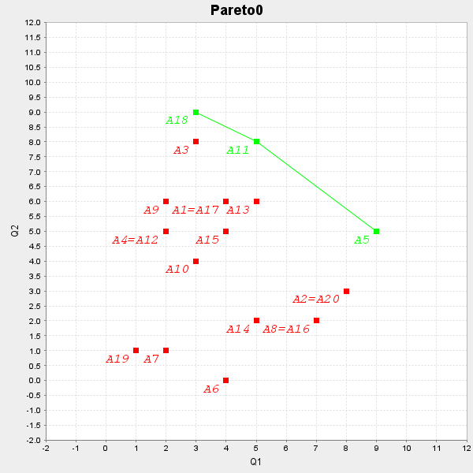
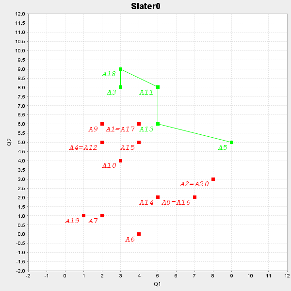
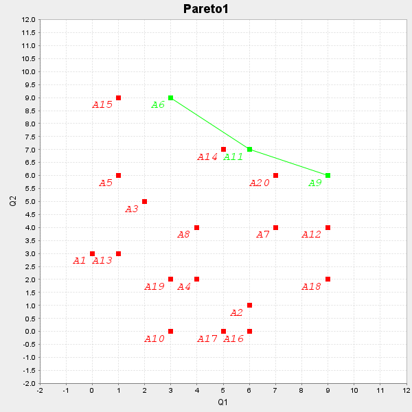
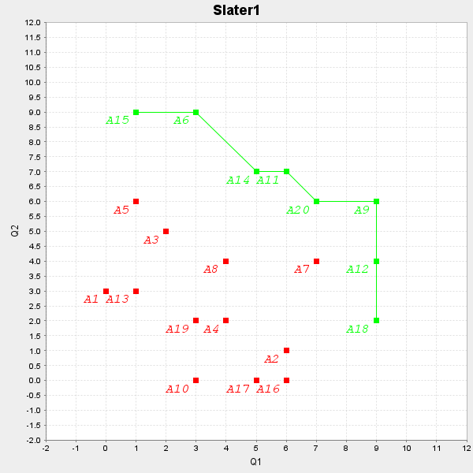
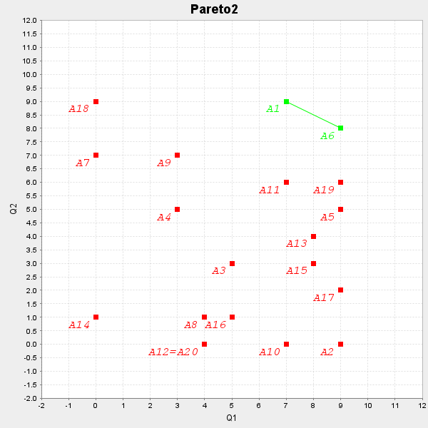
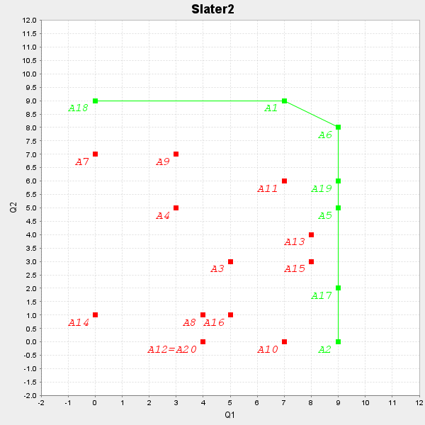
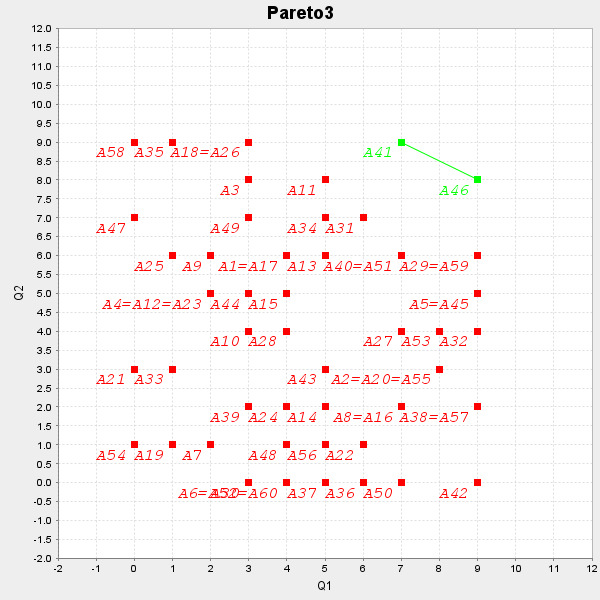
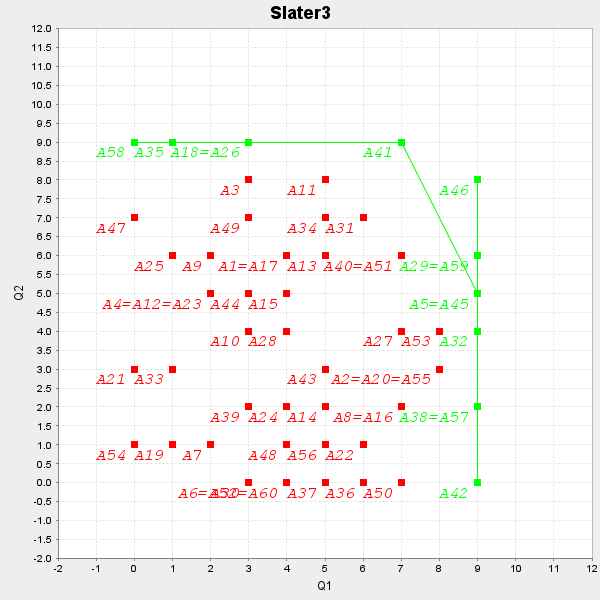

# decision-making-theory
Decision Making Theory at KPI

## Pareto optimal

<body>
    

        <table>
            <tbody><tr>
                <th colspan="1"></th>
                <th colspan="20">Alternatives</th>
            </tr>
            <tr>
                <th>Criteria</th>
                <th>A1</th>
                <th>A2</th>
                <th>A3</th>
                <th>A4</th>
                <th>A5</th>
                <th>A6</th>
                <th>A7</th>
                <th>A8</th>
                <th>A9</th>
                <th>A10</th>
                <th>A11</th>
                <th>A12</th>
                <th>A13</th>
                <th>A14</th>
                <th>A15</th>
                <th>A16</th>
                <th>A17</th>
                <th>A18</th>
                <th>A19</th>
                <th>A20</th>
            </tr>
            <tr>
                <td>Q1</td>
                <td>4</td>
                <td>8</td>
                <td>3</td>
                <td>2</td>
                <td>9</td>
                <td>4</td>
                <td>2</td>
                <td>7</td>
                <td>2</td>
                <td>3</td>
                <td>5</td>
                <td>2</td>
                <td>5</td>
                <td>5</td>
                <td>4</td>
                <td>7</td>
                <td>4</td>
                <td>3</td>
                <td>1</td>
                <td>8</td>
            </tr>
            <tr>
                <td>Q2</td>
                <td>6</td>
                <td>3</td>
                <td>8</td>
                <td>5</td>
                <td>5</td>
                <td>0</td>
                <td>1</td>
                <td>2</td>
                <td>6</td>
                <td>4</td>
                <td>8</td>
                <td>5</td>
                <td>6</td>
                <td>2</td>
                <td>5</td>
                <td>2</td>
                <td>6</td>
                <td>9</td>
                <td>1</td>
                <td>3</td>
            </tr>
            <tr>
                <td>Pareto</td>
                <td>A1</td>
                <td>A2</td>
                <td>A3</td>
                <td>A4</td>
                <td></td>
                <td>A6</td>
                <td>A7</td>
                <td>A8</td>
                <td>A9</td>
                <td>A10</td>
                <td></td>
                <td>A12</td>
                <td>A13</td>
                <td>A14</td>
                <td>A15</td>
                <td>A16</td>
                <td>A17</td>
                <td></td>
                <td>A19</td>
                <td>A20</td>
            </tr>
            <tr>
                <td>Slater</td>
                <td>A1</td>
                <td>A2</td>
                <td></td>
                <td>A4</td>
                <td></td>
                <td>A6</td>
                <td>A7</td>
                <td>A8</td>
                <td>A9</td>
                <td>A10</td>
                <td></td>
                <td>A12</td>
                <td></td>
                <td>A14</td>
                <td>A15</td>
                <td>A16</td>
                <td>A17</td>
                <td></td>
                <td>A19</td>
                <td>A20</td>
            </tr>
        </tbody></table>
        

            
Pareto set of solutions: A5,A11,A18;

        

        

            
Slater set of solutions: A3,A5,A11,A13,A18;

        

        

            
          
        

    

    

        <table>
            <tbody><tr>
                <th colspan="1"></th>
                <th colspan="20">Alternatives</th>
            </tr>
            <tr>
                <th>Criteria</th>
                <th>A1</th>
                <th>A2</th>
                <th>A3</th>
                <th>A4</th>
                <th>A5</th>
                <th>A6</th>
                <th>A7</th>
                <th>A8</th>
                <th>A9</th>
                <th>A10</th>
                <th>A11</th>
                <th>A12</th>
                <th>A13</th>
                <th>A14</th>
                <th>A15</th>
                <th>A16</th>
                <th>A17</th>
                <th>A18</th>
                <th>A19</th>
                <th>A20</th>
            </tr>
            <tr>
                <td>Q1</td>
                <td>0</td>
                <td>6</td>
                <td>2</td>
                <td>4</td>
                <td>1</td>
                <td>3</td>
                <td>7</td>
                <td>4</td>
                <td>9</td>
                <td>3</td>
                <td>6</td>
                <td>9</td>
                <td>1</td>
                <td>5</td>
                <td>1</td>
                <td>6</td>
                <td>5</td>
                <td>9</td>
                <td>3</td>
                <td>7</td>
            </tr>
            <tr>
                <td>Q2</td>
                <td>3</td>
                <td>1</td>
                <td>5</td>
                <td>2</td>
                <td>6</td>
                <td>9</td>
                <td>4</td>
                <td>4</td>
                <td>6</td>
                <td>0</td>
                <td>7</td>
                <td>4</td>
                <td>3</td>
                <td>7</td>
                <td>9</td>
                <td>0</td>
                <td>0</td>
                <td>2</td>
                <td>2</td>
                <td>6</td>
            </tr>
            <tr>
                <td>Pareto</td>
                <td>A1</td>
                <td>A2</td>
                <td>A3</td>
                <td>A4</td>
                <td>A5</td>
                <td></td>
                <td>A7</td>
                <td>A8</td>
                <td></td>
                <td>A10</td>
                <td></td>
                <td>A12</td>
                <td>A13</td>
                <td>A14</td>
                <td>A15</td>
                <td>A16</td>
                <td>A17</td>
                <td>A18</td>
                <td>A19</td>
                <td>A20</td>
            </tr>
            <tr>
                <td>Slater</td>
                <td>A1</td>
                <td>A2</td>
                <td>A3</td>
                <td>A4</td>
                <td>A5</td>
                <td></td>
                <td>A7</td>
                <td>A8</td>
                <td></td>
                <td>A10</td>
                <td></td>
                <td></td>
                <td>A13</td>
                <td></td>
                <td></td>
                <td>A16</td>
                <td>A17</td>
                <td></td>
                <td>A19</td>
                <td></td>
            </tr>
        </tbody></table>
        

            
Pareto set of solutions: A6,A9,A11;

        

        

            
Slater set of solutions: A6,A9,A11,A12,A14,A15,A18,A20;

        

        

            
          
        

    

    

        <table>
            <tbody><tr>
                <th colspan="1"></th>
                <th colspan="20">Alternatives</th>
            </tr>
            <tr>
                <th>Criteria</th>
                <th>A1</th>
                <th>A2</th>
                <th>A3</th>
                <th>A4</th>
                <th>A5</th>
                <th>A6</th>
                <th>A7</th>
                <th>A8</th>
                <th>A9</th>
                <th>A10</th>
                <th>A11</th>
                <th>A12</th>
                <th>A13</th>
                <th>A14</th>
                <th>A15</th>
                <th>A16</th>
                <th>A17</th>
                <th>A18</th>
                <th>A19</th>
                <th>A20</th>
            </tr>
            <tr>
                <td>Q1</td>
                <td>7</td>
                <td>9</td>
                <td>5</td>
                <td>3</td>
                <td>9</td>
                <td>9</td>
                <td>0</td>
                <td>4</td>
                <td>3</td>
                <td>7</td>
                <td>7</td>
                <td>4</td>
                <td>8</td>
                <td>0</td>
                <td>8</td>
                <td>5</td>
                <td>9</td>
                <td>0</td>
                <td>9</td>
                <td>4</td>
            </tr>
            <tr>
                <td>Q2</td>
                <td>9</td>
                <td>0</td>
                <td>3</td>
                <td>5</td>
                <td>5</td>
                <td>8</td>
                <td>7</td>
                <td>1</td>
                <td>7</td>
                <td>0</td>
                <td>6</td>
                <td>0</td>
                <td>4</td>
                <td>1</td>
                <td>3</td>
                <td>1</td>
                <td>2</td>
                <td>9</td>
                <td>6</td>
                <td>0</td>
            </tr>
            <tr>
                <td>Pareto</td>
                <td></td>
                <td>A2</td>
                <td>A3</td>
                <td>A4</td>
                <td>A5</td>
                <td></td>
                <td>A7</td>
                <td>A8</td>
                <td>A9</td>
                <td>A10</td>
                <td>A11</td>
                <td>A12</td>
                <td>A13</td>
                <td>A14</td>
                <td>A15</td>
                <td>A16</td>
                <td>A17</td>
                <td>A18</td>
                <td>A19</td>
                <td>A20</td>
            </tr>
            <tr>
                <td>Slater</td>
                <td></td>
                <td></td>
                <td>A3</td>
                <td>A4</td>
                <td></td>
                <td></td>
                <td>A7</td>
                <td>A8</td>
                <td>A9</td>
                <td>A10</td>
                <td>A11</td>
                <td>A12</td>
                <td>A13</td>
                <td>A14</td>
                <td>A15</td>
                <td>A16</td>
                <td></td>
                <td></td>
                <td></td>
                <td>A20</td>
            </tr>
        </tbody></table>
        

            
Pareto set of solutions: A1,A6;

        

        

            
Slater set of solutions: A1,A2,A5,A6,A17,A18,A19;

        

        

            
          
        

    

    

        <table>
            <tbody><tr>
                <th colspan="1"></th>
                <th colspan="60">Alternatives</th>
            </tr>
            <tr>
                <th>Criteria</th>
                <th>A1</th>
                <th>A2</th>
                <th>A3</th>
                <th>A4</th>
                <th>A5</th>
                <th>A6</th>
                <th>A7</th>
                <th>A8</th>
                <th>A9</th>
                <th>A10</th>
                <th>A11</th>
                <th>A12</th>
                <th>A13</th>
                <th>A14</th>
                <th>A15</th>
                <th>A16</th>
                <th>A17</th>
                <th>A18</th>
                <th>A19</th>
                <th>A20</th>
                <th>A21</th>
                <th>A22</th>
                <th>A23</th>
                <th>A24</th>
                <th>A25</th>
                <th>A26</th>
                <th>A27</th>
                <th>A28</th>
                <th>A29</th>
                <th>A30</th>
                <th>A31</th>
                <th>A32</th>
                <th>A33</th>
                <th>A34</th>
                <th>A35</th>
                <th>A36</th>
                <th>A37</th>
                <th>A38</th>
                <th>A39</th>
                <th>A40</th>
                <th>A41</th>
                <th>A42</th>
                <th>A43</th>
                <th>A44</th>
                <th>A45</th>
                <th>A46</th>
                <th>A47</th>
                <th>A48</th>
                <th>A49</th>
                <th>A50</th>
                <th>A51</th>
                <th>A52</th>
                <th>A53</th>
                <th>A54</th>
                <th>A55</th>
                <th>A56</th>
                <th>A57</th>
                <th>A58</th>
                <th>A59</th>
                <th>A60</th>
            </tr>
            <tr>
                <td>Q1</td>
                <td>4</td>
                <td>8</td>
                <td>3</td>
                <td>2</td>
                <td>9</td>
                <td>4</td>
                <td>2</td>
                <td>7</td>
                <td>2</td>
                <td>3</td>
                <td>5</td>
                <td>2</td>
                <td>5</td>
                <td>5</td>
                <td>4</td>
                <td>7</td>
                <td>4</td>
                <td>3</td>
                <td>1</td>
                <td>8</td>
                <td>0</td>
                <td>6</td>
                <td>2</td>
                <td>4</td>
                <td>1</td>
                <td>3</td>
                <td>7</td>
                <td>4</td>
                <td>9</td>
                <td>3</td>
                <td>6</td>
                <td>9</td>
                <td>1</td>
                <td>5</td>
                <td>1</td>
                <td>6</td>
                <td>5</td>
                <td>9</td>
                <td>3</td>
                <td>7</td>
                <td>7</td>
                <td>9</td>
                <td>5</td>
                <td>3</td>
                <td>9</td>
                <td>9</td>
                <td>0</td>
                <td>4</td>
                <td>3</td>
                <td>7</td>
                <td>7</td>
                <td>4</td>
                <td>8</td>
                <td>0</td>
                <td>8</td>
                <td>5</td>
                <td>9</td>
                <td>0</td>
                <td>9</td>
                <td>4</td>
            </tr>
            <tr>
                <td>Q2</td>
                <td>6</td>
                <td>3</td>
                <td>8</td>
                <td>5</td>
                <td>5</td>
                <td>0</td>
                <td>1</td>
                <td>2</td>
                <td>6</td>
                <td>4</td>
                <td>8</td>
                <td>5</td>
                <td>6</td>
                <td>2</td>
                <td>5</td>
                <td>2</td>
                <td>6</td>
                <td>9</td>
                <td>1</td>
                <td>3</td>
                <td>3</td>
                <td>1</td>
                <td>5</td>
                <td>2</td>
                <td>6</td>
                <td>9</td>
                <td>4</td>
                <td>4</td>
                <td>6</td>
                <td>0</td>
                <td>7</td>
                <td>4</td>
                <td>3</td>
                <td>7</td>
                <td>9</td>
                <td>0</td>
                <td>0</td>
                <td>2</td>
                <td>2</td>
                <td>6</td>
                <td>9</td>
                <td>0</td>
                <td>3</td>
                <td>5</td>
                <td>5</td>
                <td>8</td>
                <td>7</td>
                <td>1</td>
                <td>7</td>
                <td>0</td>
                <td>6</td>
                <td>0</td>
                <td>4</td>
                <td>1</td>
                <td>3</td>
                <td>1</td>
                <td>2</td>
                <td>9</td>
                <td>6</td>
                <td>0</td>
            </tr>
            <tr>
                <td>Pareto</td>
                <td>A1</td>
                <td>A2</td>
                <td>A3</td>
                <td>A4</td>
                <td>A5</td>
                <td>A6</td>
                <td>A7</td>
                <td>A8</td>
                <td>A9</td>
                <td>A10</td>
                <td>A11</td>
                <td>A12</td>
                <td>A13</td>
                <td>A14</td>
                <td>A15</td>
                <td>A16</td>
                <td>A17</td>
                <td>A18</td>
                <td>A19</td>
                <td>A20</td>
                <td>A21</td>
                <td>A22</td>
                <td>A23</td>
                <td>A24</td>
                <td>A25</td>
                <td>A26</td>
                <td>A27</td>
                <td>A28</td>
                <td>A29</td>
                <td>A30</td>
                <td>A31</td>
                <td>A32</td>
                <td>A33</td>
                <td>A34</td>
                <td>A35</td>
                <td>A36</td>
                <td>A37</td>
                <td>A38</td>
                <td>A39</td>
                <td>A40</td>
                <td></td>
                <td>A42</td>
                <td>A43</td>
                <td>A44</td>
                <td>A45</td>
                <td></td>
                <td>A47</td>
                <td>A48</td>
                <td>A49</td>
                <td>A50</td>
                <td>A51</td>
                <td>A52</td>
                <td>A53</td>
                <td>A54</td>
                <td>A55</td>
                <td>A56</td>
                <td>A57</td>
                <td>A58</td>
                <td>A59</td>
                <td>A60</td>
            </tr>
            <tr>
                <td>Slater</td>
                <td>A1</td>
                <td>A2</td>
                <td>A3</td>
                <td>A4</td>
                <td></td>
                <td>A6</td>
                <td>A7</td>
                <td>A8</td>
                <td>A9</td>
                <td>A10</td>
                <td>A11</td>
                <td>A12</td>
                <td>A13</td>
                <td>A14</td>
                <td>A15</td>
                <td>A16</td>
                <td>A17</td>
                <td></td>
                <td>A19</td>
                <td>A20</td>
                <td>A21</td>
                <td>A22</td>
                <td>A23</td>
                <td>A24</td>
                <td>A25</td>
                <td></td>
                <td>A27</td>
                <td>A28</td>
                <td></td>
                <td>A30</td>
                <td>A31</td>
                <td></td>
                <td>A33</td>
                <td>A34</td>
                <td></td>
                <td>A36</td>
                <td>A37</td>
                <td></td>
                <td>A39</td>
                <td>A40</td>
                <td></td>
                <td></td>
                <td>A43</td>
                <td>A44</td>
                <td></td>
                <td></td>
                <td>A47</td>
                <td>A48</td>
                <td>A49</td>
                <td>A50</td>
                <td>A51</td>
                <td>A52</td>
                <td>A53</td>
                <td>A54</td>
                <td>A55</td>
                <td>A56</td>
                <td></td>
                <td></td>
                <td></td>
                <td>A60</td>
            </tr>
        </tbody></table>
        

            
Pareto set of solutions: A41,A46;

        

        

            
Slater set of solutions: A5,A18,A26,A29,A32,A35,A38,A41,A42,A45,A46,A57,A58,A59;

        

        

            
          
        

    

</body>

## Packing problem

<body>
<table>
    <tbody><tr>
        <th colspan="1">Data</th>
        <th colspan="1">Analytical calculation (number of containers)</th>
    </tr>
    <tr>
        <th>1 row</th>
        <td>10</td>
    </tr>
    <tr>
        <th>2 row</th>
        <td>10</td>
    </tr>
    <tr>
        <th>3 row</th>
        <td>12</td>
    </tr>
    <tr>
        <th>4 row</th>
        <td>32</td>
    </tr>
</tbody></table>
<table>
    <tbody><tr>
        <th colspan="1" rowspan="3">Data</th>
        <th colspan="8" rowspan="1">Unordered</th>
    </tr>
    <tr>
        <th colspan="4">Container counter</th>
        <th colspan="4">Complexity</th>
    </tr>
    <tr>
        <th colspan="1">NFA</th>
        <th colspan="1">FFA</th>
        <th colspan="1">WFA</th>
        <th colspan="1">BFA</th>
        <th colspan="1">NFA</th>
        <th colspan="1">FFA</th>
        <th colspan="1">WFA</th>
        <th colspan="1">BFA</th>
    </tr>
    <tr>
        <th>1 row</th>
        <td>12</td>
        <td>12</td>
        <td>12</td>
        <td>12</td>
        <td>20</td>
        <td>86</td>
        <td>86</td>
        <td>90</td>
    </tr>
    <tr>
        <th>2 row</th>
        <td>13</td>
        <td>12</td>
        <td>13</td>
        <td>12</td>
        <td>20</td>
        <td>86</td>
        <td>98</td>
        <td>103</td>
    </tr>
    <tr>
        <th>3 row</th>
        <td>16</td>
        <td>14</td>
        <td>16</td>
        <td>14</td>
        <td>20</td>
        <td>113</td>
        <td>140</td>
        <td>133</td>
    </tr>
    <tr>
        <th>4 row</th>
        <td>41</td>
        <td>36</td>
        <td>41</td>
        <td>37</td>
        <td>60</td>
        <td>720</td>
        <td>880</td>
        <td>920</td>
    </tr>
</tbody></table>
<table>
    <tbody><tr>
        <th colspan="1" rowspan="3">Data</th>
        <th colspan="8" rowspan="1">Ordered Ascending</th>
    </tr>
    <tr>
        <th colspan="4">Container counter</th>
        <th colspan="4">Complexity</th>
    </tr>
    <tr>
        <th colspan="1">NFA</th>
        <th colspan="1">FFA</th>
        <th colspan="1">WFA</th>
        <th colspan="1">BFA</th>
        <th colspan="1">NFA</th>
        <th colspan="1">FFA</th>
        <th colspan="1">WFA</th>
        <th colspan="1">BFA</th>
    </tr>
    <tr>
        <th>1 row</th>
        <td>12</td>
        <td>12</td>
        <td>12</td>
        <td>12</td>
        <td>20</td>
        <td>86</td>
        <td>86</td>
        <td>86</td>
    </tr>
    <tr>
        <th>2 row</th>
        <td>13</td>
        <td>13</td>
        <td>13</td>
        <td>13</td>
        <td>20</td>
        <td>98</td>
        <td>98</td>
        <td>98</td>
    </tr>
    <tr>
        <th>3 row</th>
        <td>14</td>
        <td>14</td>
        <td>14</td>
        <td>14</td>
        <td>20</td>
        <td>111</td>
        <td>111</td>
        <td>111</td>
    </tr>
    <tr>
        <th>4 row</th>
        <td>40</td>
        <td>40</td>
        <td>40</td>
        <td>40</td>
        <td>60</td>
        <td>840</td>
        <td>840</td>
        <td>840</td>
    </tr>
</tbody></table>
<table>
    <tbody><tr>
        <th colspan="1" rowspan="3">Data</th>
        <th colspan="8" rowspan="1">Ordered Descending</th>
    </tr>
    <tr>
        <th colspan="4">Container counter</th>
        <th colspan="4">Complexity</th>
    </tr>
    <tr>
        <th colspan="1">NFA</th>
        <th colspan="1">FFA</th>
        <th colspan="1">WFA</th>
        <th colspan="1">BFA</th>
        <th colspan="1">NFA</th>
        <th colspan="1">FFA</th>
        <th colspan="1">WFA</th>
        <th colspan="1">BFA</th>
    </tr>
    <tr>
        <th>1 row</th>
        <td>12</td>
        <td>11</td>
        <td>11</td>
        <td>11</td>
        <td>20</td>
        <td>87</td>
        <td>87</td>
        <td>87</td>
    </tr>
    <tr>
        <th>2 row</th>
        <td>13</td>
        <td>11</td>
        <td>11</td>
        <td>11</td>
        <td>20</td>
        <td>90</td>
        <td>90</td>
        <td>90</td>
    </tr>
    <tr>
        <th>3 row</th>
        <td>14</td>
        <td>14</td>
        <td>14</td>
        <td>14</td>
        <td>20</td>
        <td>111</td>
        <td>111</td>
        <td>111</td>
    </tr>
    <tr>
        <th>4 row</th>
        <td>40</td>
        <td>33</td>
        <td>33</td>
        <td>33</td>
        <td>60</td>
        <td>768</td>
        <td>768</td>
        <td>858</td>
    </tr>
</tbody></table>

</body>

